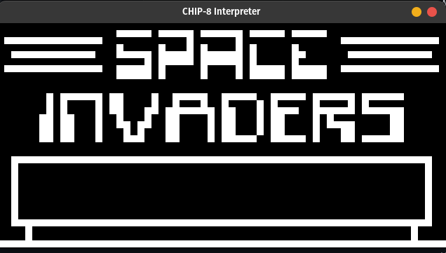
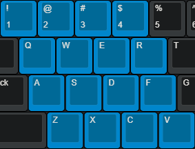

# chip8_interpreter


## Introduction

CHIP-8 is an interpreted programming language, developed by Joseph Weisbecker made on his 1802 Microprocessor. It was initially used on the COSMAC VIP and Telmac 1800 8-bit microcomputers in the mid-1970s.

> Source: [Wikipedia](https://en.wikipedia.org/wiki/CHIP-8)

The project's aim is to emulate the behavior of the CHIP-8 and enable the user to run CHIP-8 programs on modern hardware, like PONG or SPACE INVADERS.

## Preview



## Installation

### Linux

Requirements:

-   gcc
-   SDL2

Download the repo:

```bash
git clone https://github.com/galatea21/chip8_interpreter.git
```

build chip8_interpreter:

```bash
cd chip8_interpreter && make
```

## Usage

### Run

```
./chip8.out path/to/your/ROM
```

### Input

**CHIP-8 Keypad**


> Source: [Tobiasvl's blog](https://tobiasvl.github.io/blog/write-a-chip-8-emulator/)

**PC Keyboard**



> The key mappings of the interpreter. Source: [chip-walo](https://github.com/diamant3/chip-walo)

## Acknowledgements

-   [Cowgod](http://devernay.free.fr/hacks/chip8/C8TECH10.HTM)
-   [Tobiasvl](https://tobiasvl.github.io/blog/write-a-chip-8-emulator/)
-   [chip8-test-suite by Timendus](https://github.com/Timendus/chip8-test-suite)
-   [SDL2](https://www.libsdl.org/)
-   [chip-walo](https://github.com/diamant3/chip-walo)
-   [EmuDev subreddit](https://www.reddit.com/r/EmuDev/)
